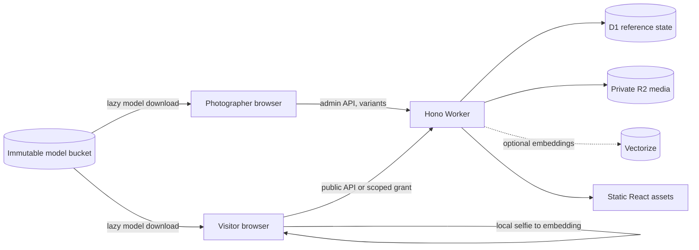

# Cadrora architecture

## Context and goals

Cadrora serves photo galleries from a single Cloudflare deployment that a photographer can operate without a terminal after installation. The architecture keeps public assets cheap, private media authorized, image processing out of the Worker CPU budget, and optional facial search isolated from gallery availability. The internal D1 schema retains its original `events` table name to avoid a destructive storage migration; every HTTP route and user-facing label uses “gallery”.

Non-goals for v1 include SSR, video, RAW/HEIC import, payment, a CLI product, multi-photographer tenancy, microservices, and cross-event biometric profiles.

## System view

The React SPA is static. It contains a public photographer website at `/` and `/contact`, event galleries under `/e/*`, and the browser-operated admin surface under `/admin/*`. Cloudflare invokes the Worker first for `/api/*`, `/media/*`, authenticated admin pages, model artifacts, and event pages under `/e/*`. Event pages pass through the Worker only so recognized crawlers can receive a narrow metadata shell; ordinary navigation delegates to the static-assets binding and its SPA fallback. The public landing and contact pages retain compiled fallback content and no mandatory external runtime dependency, so they stay useful if D1/gallery API, analytics, or the optional click-to-load map is unavailable.

## Runtime responsibilities

### Browser

- React renders public and admin flows with shared components and FR/EN resources.
- Build-time `VITE_*` values provide intentionally public fallback photographer/contact content and the optional restricted Google Maps Embed API key; they never contain secrets. The contact map uses keyless, click-to-load OpenStreetMap by default. Owner-managed D1 site settings override the public presentation at runtime.
- TanStack Query owns remote state.
- Import workers decode images, normalize orientation, remove private metadata, encode variants, and upload bounded concurrent streams.
- Optional ONNX models run locally. A visitor selfie is never uploaded.

### Worker

- Hono applies request identity, error conversion, headers, auth context, Turnstile scoping, rate limiting, routing, and cache policy.
- Routes validate both input and output with shared Zod schemas.
- The Worker performs authorization and orchestration only; it does not decode images or run ML.
- Media object keys come from D1 state, and R2 bodies are streamed.

### Persistence

- D1 is the source of truth for visibility, lifecycle, authorization versions, object metadata, and pending maintenance.
- R2 stores private media and immutable model artifacts.
- Vectorize stores event/generation-scoped embeddings when configured.
- Since these services do not share a transaction, `maintenance_jobs` is the durable outbox for deletion, purge, and reconciliation.

## Key flows

Import declares an import and photo records, snapshots whether unchanged originals are offered for download, encodes bounded chunks in the browser, upserts each derived variant and optional original, optionally adds face references, finalizes photos, and finally publishes a gallery. Original delivery requires gallery downloads. Every step is retry-safe on natural keys. Derived copies remove private source metadata; retained originals do not. Turning off original delivery fences access immediately; an explicit maintenance job can then remove only stored originals while preserving prepared photos.

Protected access exchanges an event password plus Turnstile proof for a grant scoped to the event and current `accessVersion`. Admin and event password verifiers are domain-separated HMAC-SHA-256 values keyed by a Worker-only `AUTH_PEPPER`; this avoids the former PBKDF2 cost exceeding the Workers Free 10 ms CPU allowance. The same grant is checked for metadata and media. Password rotation increments the version. The reserved seeded demo credential may bypass verification only when the explicit showcase gate is enabled.

In protected galleries, a photo heart is a single D1-backed shared state. A same-origin, grant-checked Worker write changes only a published photo in that gallery; public-gallery reads mask the state and public galleries cannot use the write route. No visitor identity or reaction count is stored.

Taking a gallery offline sets a reversible D1 fence and revokes existing protected grants without removing provider objects. Permanent deletion is separate: it sets `deleting_at`, cancels open imports, freezes photos, and revokes access immediately. After a five-minute quiescence window, a retryable `delete_gallery` job deletes only the R2 keys and Vectorize IDs derived from that gallery's D1 rows, then removes dependent D1 records and the gallery itself. Shared model objects are never gallery-owned and are never deleted by this path.

## Deployment shape

`wrangler.jsonc` defines one production Worker, a separately named preview Worker, static assets, D1, private R2 bindings, required secrets, and bounded configuration vars. Local development uses emulated/persisted resources. Release automation builds the chosen environment, migrates its `DB` binding remotely, and deploys it; preview and production resources and secrets remain separate.

An additional root domain or subdomain is another isolated single-tenant instance, not a tenant inside the production Worker. `npm run deploy:instance` derives a separate Worker, D1 database, media/model buckets, Vectorize index, credentials, and exact Custom Domain from an explicit instance name. Re-running the same pair is idempotent at the resource-discovery boundary; it never redirects the original Cadrora bindings.

Deployment variables define hard application ceilings. The owner can only lower the gallery, stored-media, and total-face limits from Site settings. The Worker enforces the lower effective value before the corresponding write. These are instance safeguards, not billing controls: Cloudflare allowances are pooled across the account, and request/operation/query quotas remain observable only through provider usage data.

## Related decisions

- [`ADR-001-stack.md`](decisions/ADR-001-stack.md)
- [`ADR-006-isolated-instances-and-owner-quotas.md`](decisions/ADR-006-isolated-instances-and-owner-quotas.md)
- [`technical/contracts.md`](technical/contracts.md)
- [`technical/public-website.md`](technical/public-website.md)
- [`implementation-plan.md`](implementation-plan.md)
