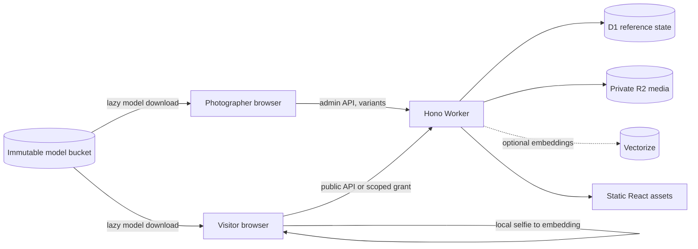

# Cadrora architecture

## Context and goals

Cadrora serves event galleries from a single Cloudflare deployment that a photographer can operate without a terminal after installation. The architecture keeps public assets cheap, private media authorized, image processing out of the Worker CPU budget, and optional facial search isolated from gallery availability.

Non-goals for v1 include SSR, video, RAW/HEIC import, payment, a CLI product, multi-photographer tenancy, microservices, and cross-event biometric profiles.

## System view

The React SPA is static. It contains a public photographer website at `/` and `/contact`, event galleries under `/e/*`, and the browser-operated admin surface under `/admin/*`. Cloudflare invokes the Worker first for `/api/*`, `/media/*`, authenticated admin pages, model artifacts, and event pages under `/e/*`. Event pages pass through the Worker only so recognized crawlers can receive a narrow metadata shell; ordinary navigation delegates to the static-assets binding and its SPA fallback. The public landing and contact pages remain static, have no external runtime dependency, and stay useful if the gallery API is temporarily unavailable.

## Runtime responsibilities

### Browser

- React renders public and admin flows with shared components and FR/EN resources.
- Build-time `VITE_*` values provide the intentionally public photographer name and contact coordinates; they never contain secrets.
- TanStack Query owns remote state.
- Import workers decode images, normalize orientation, remove private metadata, encode variants, and upload bounded concurrent streams.
- Optional ONNX models run locally. A visitor selfie is never uploaded.

### Worker

- Hono applies request identity, error conversion, headers, auth context, Turnstile scoping, rate limiting, routing, and cache policy.
- Routes validate both input and output with shared Zod schemas.
- The Worker performs authorization and orchestration only; it does not decode images or run ML.
- Media object keys come from D1 state, and R2 bodies are streamed.

### Persistence

- D1 is the source of truth for visibility, lifecycle, authorization versions, object metadata, and pending maintenance.
- R2 stores private media and immutable model artifacts.
- Vectorize stores event/generation-scoped embeddings when configured.
- Since these services do not share a transaction, `maintenance_jobs` is the durable outbox for deletion, purge, and reconciliation.

## Key flows

Import declares an import and photo records, encodes bounded chunks in the browser, upserts each variant, optionally adds face references, finalizes photos, and finally publishes an event. Every step is retry-safe on natural keys.

Protected access exchanges an event password plus Turnstile proof for a grant scoped to the event and current `accessVersion`. The same grant is checked for metadata and media. Password rotation increments the version.

Deletion removes access in D1 first. R2 and Vectorize cleanup follows asynchronously through idempotent maintenance jobs, so a failed provider call cannot resurrect public access.

## Deployment shape

`wrangler.jsonc` defines one production Worker, a separately named preview Worker, static assets, D1, private R2 bindings, required secrets, and bounded configuration vars. Local development uses emulated/persisted resources. Release automation builds the chosen environment, migrates its `DB` binding remotely, and deploys it; preview and production resources and secrets remain separate.

## Related decisions

- [`ADR-001-stack.md`](decisions/ADR-001-stack.md)
- [`technical/contracts.md`](technical/contracts.md)
- [`technical/public-website.md`](technical/public-website.md)
- [`implementation-plan.md`](implementation-plan.md)
